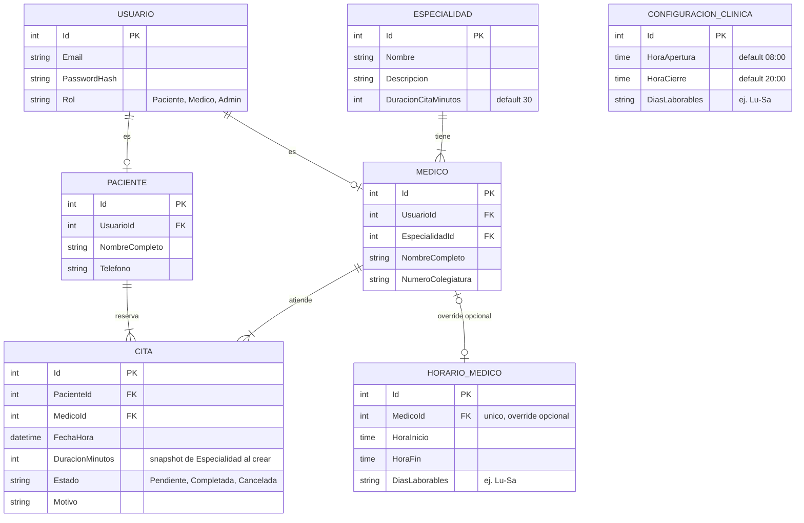

# Plan Técnico (PLAN)
## Sistema de Gestión de Citas Médicas — "WariSalud"

> Fase SDD: **Plan** — Este documento traduce `spec.md` en decisiones técnicas concretas:
> stack, arquitectura, modelo de datos y contratos de API. La IA de coding debe seguir este
> plan como fuente de verdad técnica; cualquier desviación debe justificarse en el PR/commit.

---

## 1. Stack Tecnológico

| Capa | Tecnología |
|---|---|
| Lenguaje | C# 12 |
| Framework | ASP.NET Core 8 Web API |
| Base de datos | PostgreSQL |
| ORM | Entity Framework Core (Code-First) |
| Seguridad | ASP.NET Core Identity + JWT Bearer Authentication |
| Testing | xUnit + FluentAssertions + Moq |
| Documentación | Swagger / OpenAPI |
| IDE | Visual Studio (Enterprise/Community) — Test Explorer para cobertura |

---

## 2. Arquitectura

**Patrón:** Clean Architecture con Inyección de Dependencias, 4 proyectos en
`WariSalud.sln`:

```
WariSalud.sln
├── WariSalud.Core            (Class Library) — no depende de nada
│   ├── Entities/               (Usuario, Paciente, Medico, Especialidad, Cita)
│   ├── Interfaces/             (IPacienteRepository, ICitaRepository, IMedicoRepository...)
│   ├── Exceptions/             (DoubleBookingException, FueraDeHorarioException, etc.)
│   └── Services/               (interfaces de servicios de dominio: ICitaService)
│
├── WariSalud.Infrastructure   (Class Library) — depende de Core
│   ├── Persistence/
│   │   └── ApplicationDbContext.cs   (EF Core)
│   └── Repositories/           (implementación concreta de las interfaces de Core)
│
├── WariSalud.API              (ASP.NET Core Web API) — depende de Core + Infrastructure
│   ├── Controllers/            (AuthController, CitasController, MedicosController, ...)
│   ├── DTOs/
│   ├── Middleware/             (GlobalExceptionHandlingMiddleware -> RNF05)
│   └── Program.cs              (DI, JWT config, Swagger)
│
└── WariSalud.Tests            (xUnit) — depende de Core (+ Moq para simular Infrastructure)
    ├── Services/                (tests de lógica de agendamiento/cancelación)
    └── Controllers/             (tests de autorización por rol, opcional)
```

**Regla de dependencia:** Core no referencia a Infrastructure ni a API. Infrastructure
implementa interfaces definidas en Core. API orquesta Core + Infrastructure vía DI.
Tests referencia únicamente Core (y usa Moq para simular Infrastructure) — así se logra
el 90% de cobertura sin tocar la base de datos real (RNF01).

---

## 3. Modelo de Datos (Entidad-Relación)



### Decisiones de diseño aplicadas (ver `spec.md` sección 9 para el razonamiento completo)

1. **Horario laboral en cascada:** `HorarioEfectivo(medico) = HORARIO_MEDICO(medico) ??
   CONFIGURACION_CLINICA`. `CONFIGURACION_CLINICA` es una tabla de **una sola fila**
   (configuración global, editable solo por Admin); `HORARIO_MEDICO` es opcional y
   sobrescribe el horario global únicamente para ese médico.
2. **Duración de cita = propiedad de `Especialidad`** (`DuracionCitaMinutos`), copiada
   como snapshot a `Cita.DuracionMinutos` en el momento de agendar, para no verse afectada
   por cambios futuros en la especialidad.
3. **Cancelación con 24h exactas → permitida** (umbral inclusivo `>=`).
4. **No existe regla adicional de solapamiento propio del paciente**; RF05 (máx. 2 citas
   activas/día) ya cubre ese caso.

---

## 4. Contratos de API (propuesta de endpoints)

> No estaban explícitos en los documentos originales; se proponen aquí para que la IA de
> coding tenga un contrato claro. Ajustar nombres si el equipo prefiere otra convención.

| Método | Ruta | Rol requerido | Descripción |
|---|---|---|---|
| POST | `/api/auth/register` | Público | Registro de usuario (Paciente por defecto) |
| POST | `/api/auth/login` | Público | Login → devuelve JWT |
| GET | `/api/especialidades` | Cualquier autenticado | Listar especialidades |
| POST | `/api/especialidades` | Admin | Crear especialidad |
| GET | `/api/medicos` | Cualquier autenticado | Listar médicos (filtro por especialidad) |
| GET | `/api/medicos/{id}/disponibilidad?fecha=` | Cualquier autenticado | Horarios libres del médico ese día — RNF04 (<500ms) |
| POST | `/api/citas` | Paciente | Agendar cita (aplica RF02, RF03, RF04, RF05) |
| DELETE | `/api/citas/{id}` | Paciente (dueño) | Cancelar cita (aplica RF06) |
| GET | `/api/citas/mias` | Paciente | Listar mis citas |
| GET | `/api/medicos/{id}/agenda?fecha=` | Medico (dueño) / Admin | Agenda del médico |

**Códigos de error esperados (para consistencia de tests):**
- `409 Conflict` → double-booking (RF03) o máximo de 2 citas/día (RF05)
- `422 Unprocessable Entity` → fuera de horario laboral (RF04) o cancelación fuera de plazo (RF06)
- `403 Forbidden` → intento de operar sobre recurso de otro usuario
- `401 Unauthorized` → token ausente/inválido

---

## 5. Seguridad (RNF03)

- JWT Bearer con claims: `sub` (UsuarioId), `role` (Paciente/Medico/Admin).
- `[Authorize(Roles = "Paciente")]` etc. a nivel de controlador/acción.
- Validación adicional a nivel de servicio: un Paciente solo puede cancelar/consultar
  **sus propias** citas (comparar `PacienteId` del claim vs. el recurso).

---

## 6. Middleware Global de Excepciones (RNF05)

- `GlobalExceptionHandlingMiddleware` captura excepciones de dominio custom
  (`DoubleBookingException`, `FueraDeHorarioException`, `LimiteDeCitasException`,
  `CancelacionFueraDePlazoException`, `RecursoNoEncontradoException`,
  `AccesoNoAutorizadoException`) y las traduce a códigos HTTP consistentes (sección 4),
  evitando que cualquier excepción no controlada tumbe la API (stack trace 500 genérico
  como último recurso, siempre logueado).

---

## 7. Estrategia de Testing (RNF01 — cobertura ≥90%)

1. **Patrón AAA** (Arrange, Act, Assert) en todos los tests.
2. **Mocking con Moq**: los repositorios (`ICitaRepository`, `IMedicoRepository`, etc.) se
   simulan; ningún test unitario toca SQL Server real.
3. **Foco de cobertura:** `WariSalud.Core` (entidades + servicios de dominio), especialmente
   el servicio de agendamiento (`CitaService`) y de cancelación.
4. **Casos obligatorios** (mapeados 1 a 1 con spec.md sección 7):
   - Agendar fuera de horario laboral → excepción esperada.
   - Agendar 3ª cita del día para un mismo paciente → excepción esperada.
   - Cancelar con 23h de antelación → excepción esperada.
   - Cancelar con exactamente 24h → éxito.
   - Doble reserva simultánea sobre mismo médico/horario → solo una tiene éxito.
   - Agendar con médico inexistente/inactivo → excepción esperada.
   - Cancelar cita de otro paciente → excepción de autorización.
5. Medir cobertura con Visual Studio Test Explorer / `dotnet test --collect:"XPlat Code
   Coverage"` y reportar ≥90% sobre `WariSalud.Core`.

---

## 8. Rendimiento (RNF04)

- El endpoint de disponibilidad (`GET /api/medicos/{id}/disponibilidad`) debe resolver en
  <500ms con carga nominal de 100 usuarios concurrentes. Recomendaciones técnicas:
  - Índice en `CITA(MedicoId, FechaHora)`.
  - Evitar N+1 queries: proyectar directamente a DTO en la consulta EF Core.
  - Considerar `AsNoTracking()` para queries de solo lectura.
